<div align="center">

# 🛡️ MuvAutomation Secure Challenge

### Laboratorio 3 — Red Team + Blue Team

**Aplicación web pública por HTTP: construir, atacar, detectar, corregir y verificar**


</div>

---

## 👥 Equipo

| Rol | Integrante |
|---|---|
| Estudiante | **Oscar Andrés Sánchez Porras** |
| Estudiante | **Robinson Steven Núñez Portela** |

---

## 📌 Descripción del proyecto

Este repositorio contiene la solución del **Laboratorio 3** del reto *Secure Product Challenge (FDSI)*, cuyo objetivo es establecer una **línea base deliberadamente insegura y controlada**: una aplicación web mínima publicada por **HTTP, sin autenticación ni cifrado**, sobre la cual se ejecuta un ciclo completo de trabajo ofensivo/defensivo:

<div align="center">

**Diseñar → Construir → Atacar → Detectar → Corregir → Verificar**

</div>

**Caso asignado: Falcon Incident Hub.** En vez de un sitio estático genérico, la aplicación es un prototipo que recibe alertas ficticias de CrowdStrike Falcon, permite consultarlas mediante una API y registra las acciones tomadas sobre ellas (host, identidad, indicadores). No se usa información real ni se integra directamente con CrowdStrike.

Este laboratorio es la **base acumulativa** sobre la que se construirán los siguientes retos del programa (HTTPS, identidad y roles, DevSecOps, y Cloud Purple Team).

> ⚠️ **Uso exclusivamente académico.** Todas las pruebas se ejecutan únicamente contra la IP/URL asignada al equipo, dentro de la ventana autorizada, usando datos, cuentas y tokens ficticios.

---

## 🎯 Objetivos

- 🚀 Desplegar una aplicación web mínima en una instancia Linux autorizada.
- 🔍 Identificar la superficie de ataque con **Nmap**, **curl** y **OWASP ZAP** (modo pasivo).
- 📡 Evidenciar por qué HTTP expone metadatos y contenido en tránsito.
- 🧩 Relacionar hallazgos con amenazas **STRIDE**, en especial *Information Disclosure* y *Tampering*.
- 🧾 Analizar `access.log` / `error.log` desde una perspectiva Blue Team.
- 🔧 Aplicar hardening inicial (sin adelantar autenticación ni HTTPS, reservados para el Laboratorio 3 - Parte 2).
- 🤖 Usar IA de forma responsable, sobre evidencia anonimizada.

---

## 🏗️ Arquitectura y modelo de amenazas

Diagrama de arquitectura del ejercicio (topología Kali → Nginx → API de Alertas) y DFD ligero con los dos límites de confianza (tránsito de red a servidor, y proxy a aplicación):

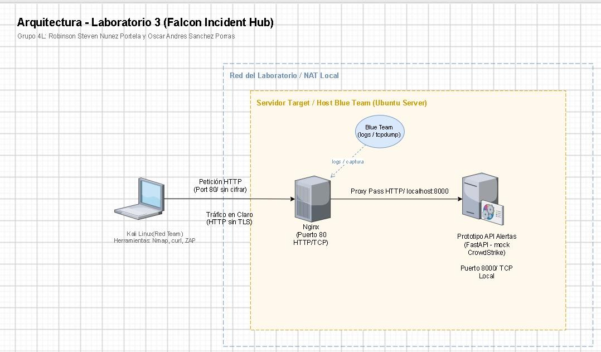

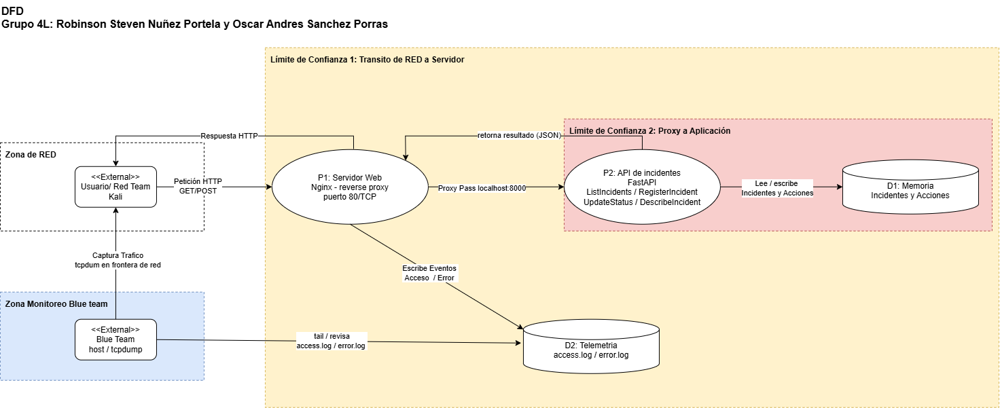

```
Adversary / Red Team (Kali)
          │  HTTP :80, texto claro
          ▼
    Nginx (reverse proxy, sin autenticación)
          │  proxy_pass → 127.0.0.1:8000
          ▼
  API de Alertas (FastAPI) — Falcon Incident Hub
   ListAlerts / RegisterAlert / UpdateAlertStatus / DescribeAlert
          │
          ▼
  Memoria (alertas simuladas + acciones registradas)
          │
          ▼
  Logs + PCAP (Blue Team, visibilidad parcial en Lab 3)
```

| Componente | Función | Evidencia esperada |
|---|---|---|
| 🐉 Kali Linux | Reconocimiento y validación autorizada | Comandos, timestamps, capturas, reporte ZAP |
| 🖥️ Ubuntu Server LTS | Host de la aplicación | Estado del servicio, firewall, configuración, logs |
| 🌐 Nginx (reverse proxy) | Enruta HTTP :80 hacia el backend, sin autenticación | Respuesta HTTP, headers, `nginx/muvautomation.conf` |
| 🧠 FastAPI (`app/main.py`) | API de Alertas — Falcon Incident Hub, datos en memoria | Respuestas JSON de `/alertas` |
| 📶 tcpdump / Wireshark | Visibilidad de red | PCAP filtrado del ejercicio |
| 📄 access.log / error.log | Telemetría defensiva | Eventos correlacionados con pruebas Red Team |
| 🤖 IA autorizada / offline | Apoyo analítico opcional | Prompt anonimizado y validación humana |

---

## 📂 Estructura del repositorio

> `app/` y `reports/zap-passive/` ya están cargados en GitHub y no se incluyen en este paquete.

```
muvautomation-secure-challenge/
├── app/                       # Backend FastAPI (ya en GitHub)
├── nginx/
│   └── muvautomation.conf     # Virtual host: reverse proxy hacia 127.0.0.1:8000
├── diagrams/
│   └── dfd-lab3.png           # Diagrama de flujo de datos (DFD), 2 límites de confianza
├── docs/                      # Capturas organizadas por fase (este entregable)
│   ├── 00-diagramas/
│   ├── 01-fase-a-construccion/
│   ├── 02-fase-b-modelado/
│   ├── 03-fase-c-red-team/
│   ├── 04-fase-d-blue-team/
│   ├── 05-wireshark/
│   ├── 06-fase-e-hardening-retest/
│   └── 07-lab3-parte2-tls-jwt-roles/
├── evidence/
│   ├── red/                   # Nmap, curl, reporte ZAP pasivo
│   ├── blue/                  # Logs, PCAP, evidencia de tráfico en claro
│   ├── retest/                # curl/nmap antes-después del hardening (Fase F)
│   └── parte2/                # Respuestas individuales: TLS, systemd, JWT, roles
├── reports/
│   └── zap-passive/           # Reporte HTML de OWASP ZAP (ya en GitHub)
├── risk-register.md           # Registro de riesgos (corregido/mitigado/aceptado/pendiente)
└── README.md
```

---

## ⚙️ Variables de entorno

```bash
export TARGET_IP=IP_ASIGNADA
export TARGET_URL=http://$TARGET_IP
export LAB_CIDR=CIDR_AUTORIZADO
```

**Valores usados en esta ejecución** (host Ubuntu conectado por Tailscale):

```bash
export TARGET_IP=100.110.229.99
export TARGET_URL=http://$TARGET_IP
```

> El host se publicó inicialmente en una red NAT local (`192.168.15.0/24`) para la Fase A, y se validó de forma remota vía Tailscale (`100.110.229.99`) para las Fases C y D.

---

## 🧪 Ciclo de trabajo

| Fase | Actividad | Responsable | Estado |
|---|---|---|---|
| A | Construcción y publicación HTTP (Ubuntu, Nginx, backend, firewall) | Builder | ✅ Completa |
| B | DFD ligero + hipótesis STRIDE + matriz de riesgos | Todo el equipo | ✅ Completa |
| C | Reconocimiento y pruebas ofensivas | Red Team | ✅ Completa |
| D | Correlación de logs y detección | Blue Team | ✅ Completa |
| E | Hardening inicial de Nginx | Blue Team | ✅ Completa |
| F | Retest y comparación antes/después | Purple Team | ✅ Completa |

### 🟢 Construcción (Fase A)

- Host Ubuntu 24.04.1 LTS verificado (`hostnamectl`, `ip -br address`) antes de instalar cualquier servicio.
- Nginx instalado, habilitado y validado escuchando en el puerto 80.
- Backend FastAPI (`app/main.py`) con los 4 endpoints de la API de Alertas, corriendo en `127.0.0.1:8000` y probado localmente antes de exponerlo.
- Virtual host de Nginx configurado como reverse proxy, y firewall (`ufw`) restringido al segmento del laboratorio (`192.168.15.0/24`).
- Prueba de acceso externo confirmada desde un navegador fuera del host.

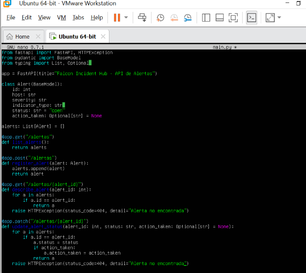

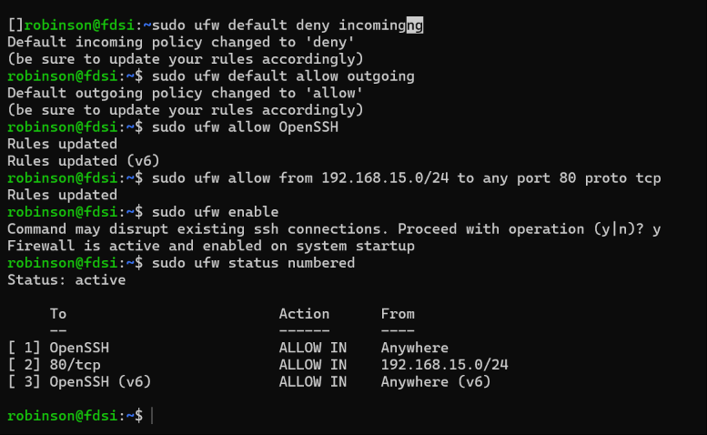

### 🔴 Hallazgos clave (Red Team)

- `nmap -sT -sV` confirmó `80/tcp open http nginx 1.28.3 (Ubuntu)`.
- `/docs` (Swagger UI) y `/openapi.json` accesibles **sin autenticación**, exponiendo los 4 endpoints de la API (`GET/POST /alertas`, `GET/PATCH /alertas/{alert_id}`) y el esquema completo de datos (**R11**).
- ZAP pasivo detectó 11 alertas (CSP ausente, Cross-Domain Misconfiguration, Anti-clickjacking Header, Sub Resource Integrity), todas de baja severidad y en su mayoría sobre recursos externos que carga Swagger UI.
- Rutas no existentes (`/`, `/admin`, `/alertas/1`) responden `404 Not Found`, sin filtrar información adicional.

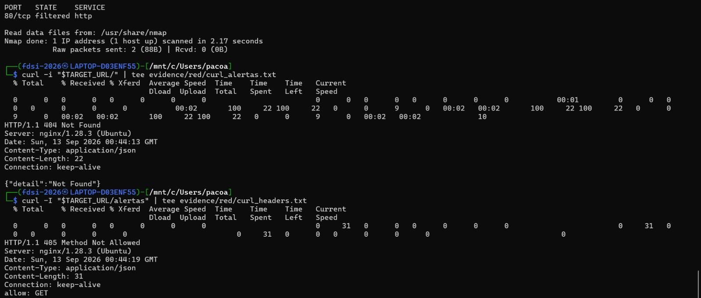

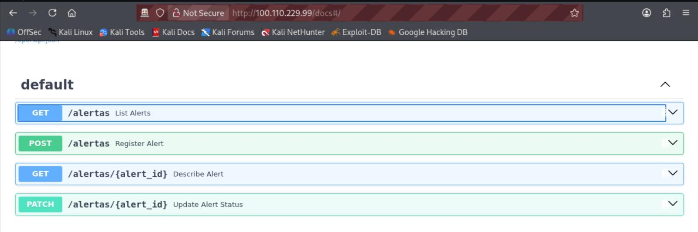

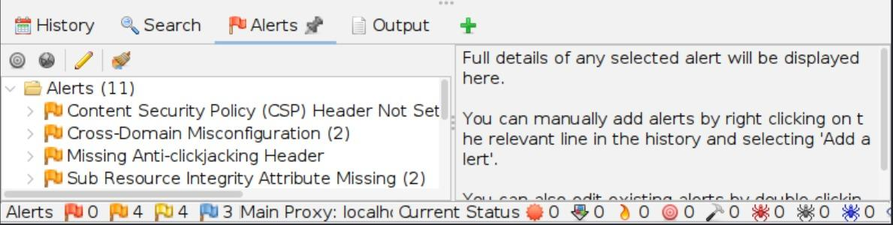

### 🔵 Detección (Blue Team)

- Captura de tráfico completada con `tcpdump` sobre la interfaz `tailscale0`: 35 paquetes correspondientes a las peticiones a `/alertas`, `/docs` y `/openapi.json`.
- `/openapi.json` confirma en texto plano el esquema completo de la API (modelos `Alert`, `HTTPValidationError`), reforzando el hallazgo R11.
- Evidencia (PCAP + volcado de texto) descargada del servidor hacia el equipo de análisis vía `scp`.
- Pendiente: correlación con `access.log` / `error.log` para R7 (Repudiation).

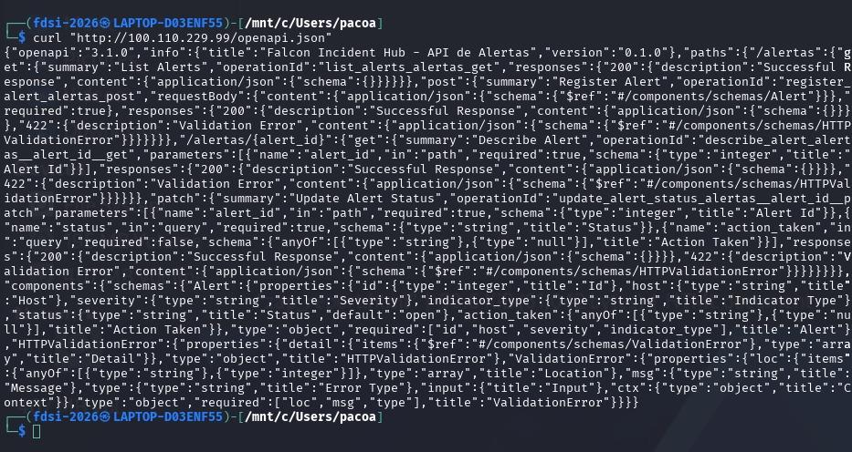

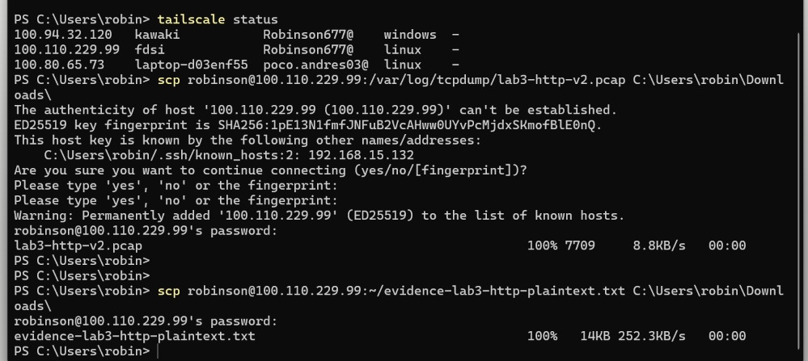

### 📡 Evidencia de tráfico en claro (Wireshark)

Los tres streams HTTP capturados (`tcp.stream eq 0, 1, 2`) confirman que tanto las peticiones como las respuestas —incluyendo el cuerpo JSON completo— viajan **sin cifrar**:

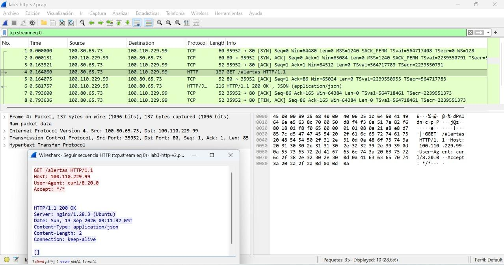

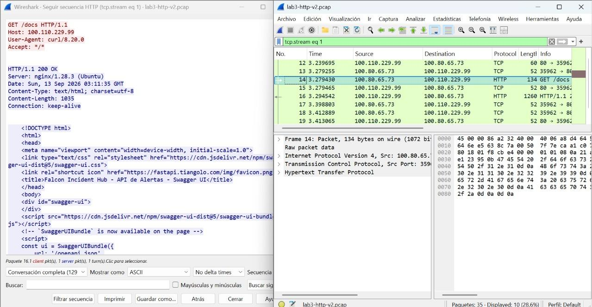

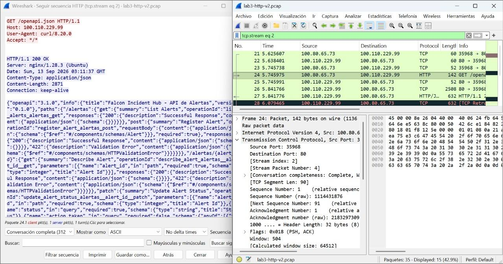

### 🛠️ Hardening aplicado (Fase E) y retest (Fase F)

Configuración final de `nginx/muvautomation.conf`:

```nginx
server_tokens off;

add_header X-Content-Type-Options "nosniff" always;
add_header X-Frame-Options "DENY" always;
add_header Referrer-Policy "no-referrer" always;

location ~ ^/(docs|openapi\.json) {
    allow 192.168.15.0/24;   # LAB_CIDR (segmento local, Fase A)
    allow 100.80.65.73;      # Tailscale - laptop-d03enf55 (Red Team)
    allow 100.94.32.120;     # Tailscale - kawaki (equipo)
    deny all;

    proxy_pass http://127.0.0.1:8000;
    proxy_set_header Host $host;
    proxy_set_header X-Real-IP $remote_addr;
    proxy_set_header X-Forwarded-For $proxy_add_x_forwarded_for;
}
```

**Nota sobre el `allow`:** el equipo opera principalmente por Tailscale (rango `100.x.x.x`) desde la Fase C en adelante, no desde el segmento local `192.168.15.0/24` de la Fase A. Restringir solo a `LAB_CIDR` habría bloqueado también al propio equipo (se verificó: un `curl` desde el servidor `fdsi` hacia su propia IP pública sale y regresa por `tailscale0`, así que Nginx nunca ve un origen `192.168.15.x`). Por eso la lista blanca combina ambos: el segmento original **y** las IPs Tailscale fijas del equipo, en lugar de abrir todo el rango CGNAT de Tailscale (`100.64.0.0/10`), que expondría el endpoint a cualquier red Tailscale del mundo.

**Resultado del retest (`curl` antes/después, ver `evidence/retest/`):**

| Riesgo | Antes | Después |
|---|---|---|
| R1 | `Server: nginx/1.28.3 (Ubuntu)` | `Server: nginx` |
| R2 | Sin headers de seguridad | `X-Content-Type-Options`, `X-Frame-Options`, `Referrer-Policy` presentes |
| R11 | `/docs` y `/openapi.json` en `200 OK` para cualquier origen | `403 Forbidden` para IPs no autorizadas; `200 OK` solo para `LAB_CIDR` e IPs Tailscale del equipo |

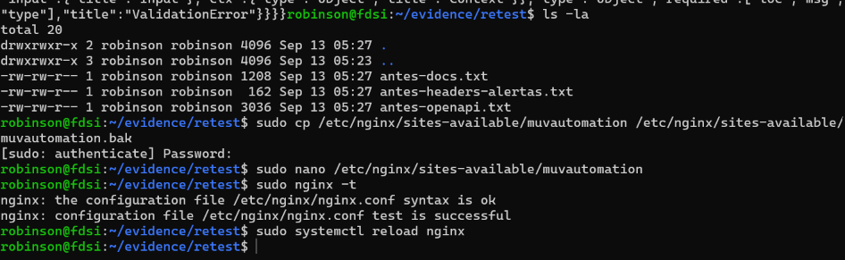

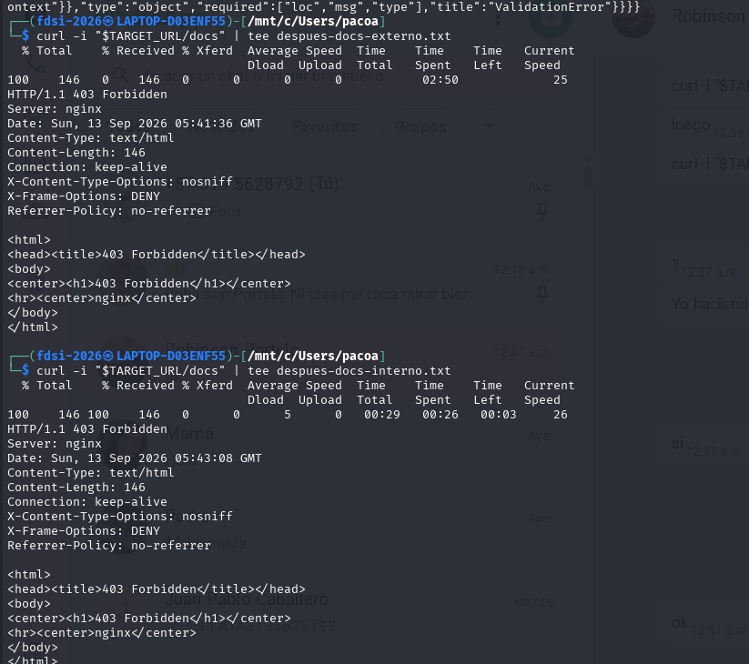

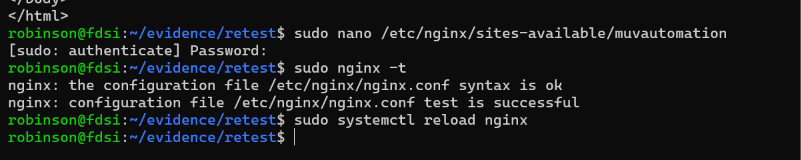

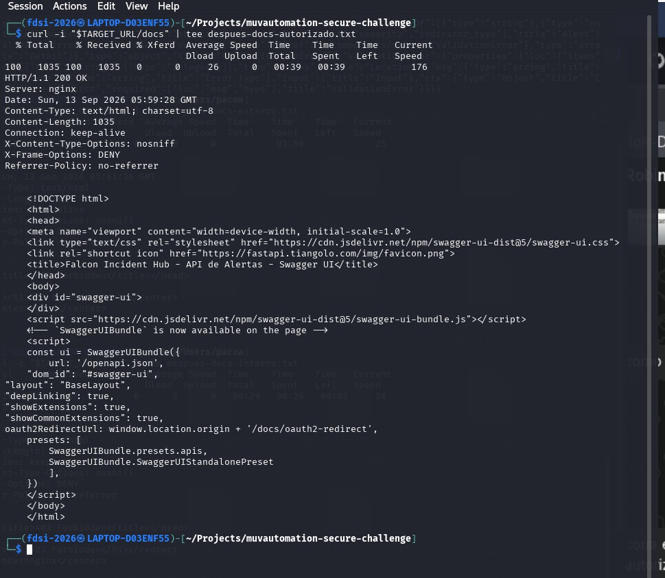

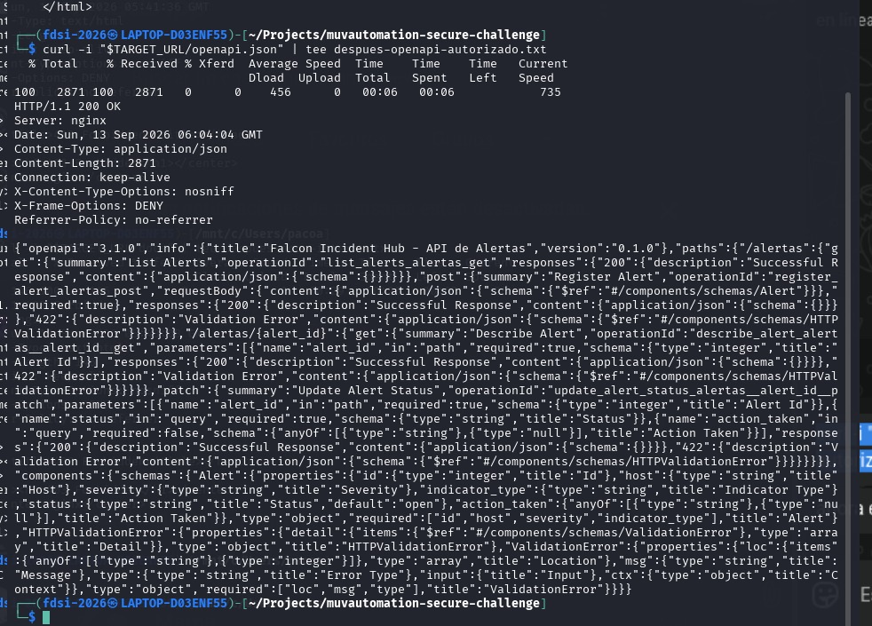

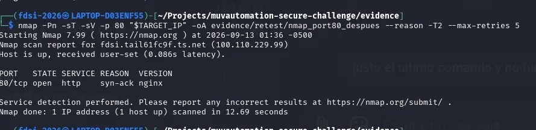

**Pendiente de Fase F:** ~~repetir el reconocimiento general con `nmap`/`curl`~~ ✅ Completado. `nmap -sT -sV -p 80` repetido desde Kali confirmó `80/tcp open http nginx` (puerto sin cambios, esperado) y sin el fingerprint de versión `1.28.3 (Ubuntu)` que sí aparecía en Fase C — evidencia adicional de que `server_tokens off` reduce la huella incluso frente a `-sV`. (Nota: el primer intento marcó `filtered` por un timeout puntual de Tailscale; se resolvió confirmando conexión directa con `tailscale ping` y repitiendo con `-T2 --max-retries 5`.)

> 🔓 **Límite pedagógico:** HTTP sigue siendo inseguro en confidencialidad e integridad, y la API no tiene autenticación real (el `allow`/`deny` por IP es una mitigación de exposición, no un control de identidad). Estos riesgos quedan abiertos intencionalmente para el **Laboratorio 3 - Parte 2** (HTTPS, identidad, sesiones y roles).

---

## 🧵 Amenazas STRIDE identificadas

| ID | STRIDE | Hipótesis | Validación |
|---|---|---|---|
| H1 | Information Disclosure | HTTP permite observar contenido y rutas en tránsito (payloads de alertas incluidos) | PCAP filtrado |
| H2 | Information Disclosure | Headers y respuestas revelan tecnología/recursos (Nginx/FastAPI) | `curl -I` + ZAP pasivo |
| H3 | Repudiation | Sin correlación temporal ni identidad, no se atribuyen solicitudes a un origen | Comparación con `access.log` |
| H4 | Tampering | Sin TLS, tráfico potencialmente alterable (no se ejecuta MITM real) | Evidencia de ausencia de protección |
| H5 | Elevation of Privilege / Tampering | Cualquiera en el segmento puede crear/modificar alertas vía `RegisterAlert`/`UpdateAlertStatus` sin autenticación | `curl -X POST/PATCH` sin credenciales desde Kali |

Ver el detalle de riesgos, severidades y estado de tratamiento en [`risk-register.md`](risk-register.md).

---

## 📸 Evidencia adicional por fase

La carpeta [`docs/`](docs/) contiene todas las capturas del laboratorio organizadas por fase:

- **`docs/00-diagramas/`** — arquitectura y DFD.
- **`docs/01-fase-a-construccion/`** — línea base del host (`hostnamectl`, `ip -br address`), instalación de Nginx, entorno virtual y código del backend FastAPI, prueba local con `curl`, configuración del reverse proxy, firewall `ufw` y prueba de acceso desde un navegador externo.
- **`docs/02-fase-b-modelado/`** — verificación de red del atacante (`ip a`), estado de Tailscale y prueba de conectividad (`curl` + `ping`) contra el objetivo.
- **`docs/03-fase-c-red-team/`** — reconocimiento con Nmap (`-sS` filtrado y `-sT -sV` confirmado), `curl` de cabeceras y contenido, exploración pasiva con OWASP ZAP (Manual Explore, árbol de sitios, panel de alertas) y verificación manual de rutas (`/`, `/admin`, `/alertas/1`, `/docs`).
- **`docs/04-fase-d-blue-team/`** — consulta de `/docs` y `/openapi.json`, y descarga de la evidencia de tráfico (`lab3-http-v2.pcap` y volcado de texto) hacia el equipo de análisis.
- **`docs/05-wireshark/`** — los 3 streams HTTP analizados en Wireshark.
- **`docs/06-fase-e-hardening-retest/`** — aplicación del hardening (`nginx -t`, `reload`), verificación de headers de seguridad, y retest de `/docs`/`/openapi.json` antes y después de restringir por IP.
- **`docs/07-lab3-parte2-tls-jwt-roles/`** — migración a HTTPS con certificado real (Tailscale/Let's Encrypt), servicio `systemd` del backend, y pruebas de autenticación JWT con roles.

---

## 🔐 Laboratorio 3 - Parte 2 — HTTPS, JWT y roles

Continuación directa del Lab 3: resuelve los 5 riesgos que quedaron explícitamente pendientes en `risk-register.md` (R3, R5, R6, R7, R10).

### 1. Arquitectura inicial (heredada de Lab 3)

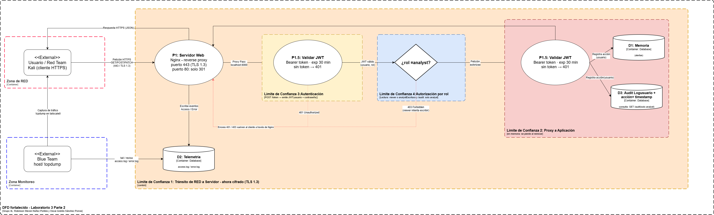


**Límites de confianza originales (Lab 3):**
1. Tránsito de red → servidor (sin cifrar)
2. Proxy → aplicación (sin control de quién cruza)

---

### 2. Arquitectura fortalecida (Lab 3 - Parte 2, estado actual)

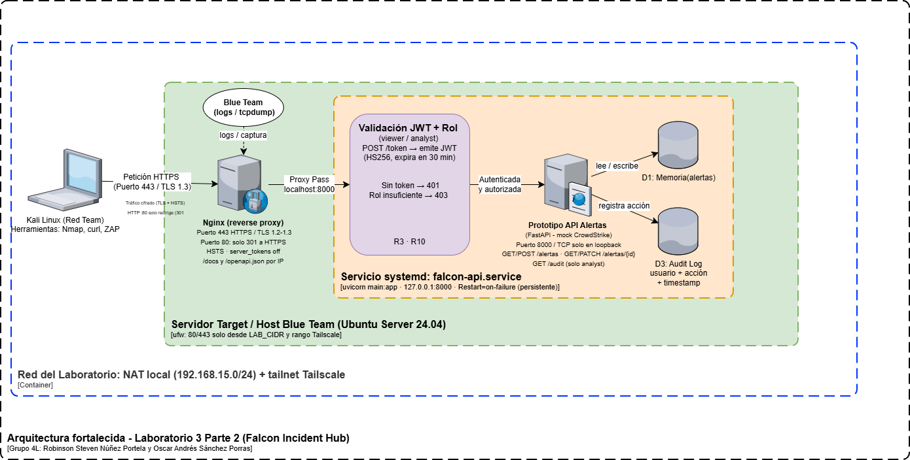

**Límites de confianza actuales (Lab 3 - Parte 2):**
1. **Tránsito de red** — ahora cifrado con TLS 1.3, certificado real (antes: texto claro)
2. **Autenticación** — nuevo. Toda solicitud a `/alertas` requiere JWT válido (antes: inexistente)
3. **Autorización por rol** — nuevo. `viewer` solo lee, `analyst` lee y escribe (antes: inexistente)
4. **Proxy → aplicación** — Nginx nunca expone `127.0.0.1:8000` directamente (heredado de Lab 3, sin cambios)

---

### 3. Mapeo Arquitectura inicial → Gap → Riesgo → Mejora → Arquitectura fortalecida

| Arquitectura inicial (Lab 3) | Gap identificado | Riesgo / Amenaza (STRIDE) | Mejora implementada (Lab 3 - Parte 2) | Arquitectura fortalecida |
|---|---|---|---|---|
| Nginx escucha solo en `:80`, HTTP plano | Sin cifrado en tránsito | **R5** Information Disclosure — contenido y credenciales futuras viajarían en texto claro | Certificado real vía `tailscale cert` (Let's Encrypt), Nginx en `:443` con `TLSv1.2`/`TLSv1.3` únicamente, HSTS, redirect 301 de `:80` a `:443` | Todo el tráfico cifrado extremo a extremo; puerto 80 solo redirige, nunca sirve contenido |
| Sin TLS, sin verificación de integridad | Tráfico modificable sin detección | **R6** Tampering — un intermediario podría alterar requests/responses sin que nadie lo note | Mismo TLS 1.3 (AEAD, `TLS_AES_256_GCM_SHA384`) garantiza integridad además de confidencialidad | Integridad verificada criptográficamente en cada request |
| `POST`/`PATCH /alertas` sin ninguna verificación | Cualquiera en la red podía escribir o modificar alertas | **R3** Elevation of Privilege / Tampering — escritura no autenticada | Endpoint `POST /token` (JWT), dependencia `require_analyst` bloqueando escritura sin rol válido | Escritura solo posible con token JWT de un usuario con rol `analyst`; sin token → `401`, con rol incorrecto → `403` |
| `access.log` solo registra IP y User-Agent | Imposible atribuir una acción a una persona | **R7** Repudiation — no hay identidad, solo origen de red | `audit_log` en memoria: cada `POST`/`PATCH` queda con `username`, `role`, `action` y `timestamp` reales del token | Endpoint `GET /audit` (solo analyst) permite atribuir cada escritura a un usuario específico, no solo a una IP compartida |
| Ningún endpoint distingue lectura de escritura | Cualquiera con acceso de red tenía privilegios de administrador de facto | **R10** Elevation of Privilege — sin modelo de roles | Roles `viewer` (solo `GET`) y `analyst` (`GET`+`POST`+`PATCH`) codificados en el JWT y validados por dependencia FastAPI | Principio de mínimo privilegio aplicado: un usuario de solo consulta no puede alterar el estado del sistema |
| Backend arrancado manualmente (`uvicorn ... &`) | Proceso frágil, se pierde al cerrar sesión SSH o reiniciar | *(No era STRIDE, era disponibilidad operativa — reforzaba R9)* | Servicio `systemd` (`falcon-api.service`) con `Restart=on-failure` y `enable` para arranque automático | Backend persistente, sobrevive a desconexiones SSH y reinicios del servidor |

---

### 4. Tabla de Threat Modeling actualizada (nuevas hipótesis STRIDE de Lab 3 - Parte 2)

Estas se suman a H1–H5 ya documentadas en el `README.md` de Lab 3.

| ID | STRIDE | Hipótesis | Validación | Estado |
|---|---|---|---|---|
| H6 | Spoofing | Un JWT robado (ej. por XSS, log expuesto, o captura antes del cifrado) permite impersonar al usuario hasta que expire (30 min) | Inspección de código: no hay revocación de tokens ni lista de bloqueo | 🔵 Riesgo aceptado con mitigación parcial (expiración corta); revocación real queda para trabajo futuro |
| H7 | Tampering / Information Disclosure | `SECRET_KEY` está hardcodeada en `main.py`; si el repositorio se filtra o se sube mal, cualquiera puede firmar tokens válidos | Revisión de código — confirmado, es una decisión pedagógica explícita | 🟡 Mitigado con nota de producción en el propio código; debe migrar a variable de entorno antes de cualquier uso real |
| H8 | Tampering | Downgrade de TLS a una versión insegura (1.0/1.1) si un atacante fuerza la negociación | `ssl_protocols TLSv1.2 TLSv1.3;` en Nginx — versiones antiguas ni se ofrecen en el handshake | ✅ Mitigado — verificado con `curl -v` mostrando negociación forzada en TLS 1.3 |
| H9 | Denial of Service | El backend sigue siendo un único proceso; si se cae, `systemd` lo reinicia pero hay una ventana de indisponibilidad | Ya se observó en Lab 3 (evidencia de `502` en `error.log`); mitigado parcialmente ahora con `Restart=on-failure` | 🟡 Mitigado — sigue sin redundancia (un solo proceso, sin balanceo) |
| H10 | Repudiation | El `audit_log` vive en memoria: un reinicio del backend borra el historial de auditoría, igual que las alertas (R9 original) | Inspección de código — `audit_log: List[AuditEntry] = []` sin persistencia en disco | 🔵 Pendiente — requiere base de datos persistente (mejora futura, fuera de alcance de hoy) |

---

### 5. Riesgos que quedan abiertos después de Lab 3 - Parte 2

| Riesgo | Por qué sigue abierto |
|---|---|
| H6 (robo de token) | No hay revocación activa de JWT; solo expiración por tiempo |
| H7 (`SECRET_KEY` hardcodeada) | Decisión pedagógica; en producción debe ir en variable de entorno / secret manager |
| H9 (sin redundancia del backend) | Un solo proceso; sin balanceador ni réplicas |
| H10 (audit log no persistente) | Se pierde en cada reinicio, igual que las alertas — requiere base de datos |

---

### TLS / HTTPS

Certificado real emitido por Let's Encrypt a través de `tailscale cert` (sin necesidad de dominio público), válido para el hostname `fdsi.tail61fc9f.ts.net`. Nginx quedó configurado con `ssl_protocols TLSv1.2 TLSv1.3` (se descartan 1.0/1.1 por vulnerabilidades conocidas), HSTS, y redirección `301` automática de HTTP a HTTPS.

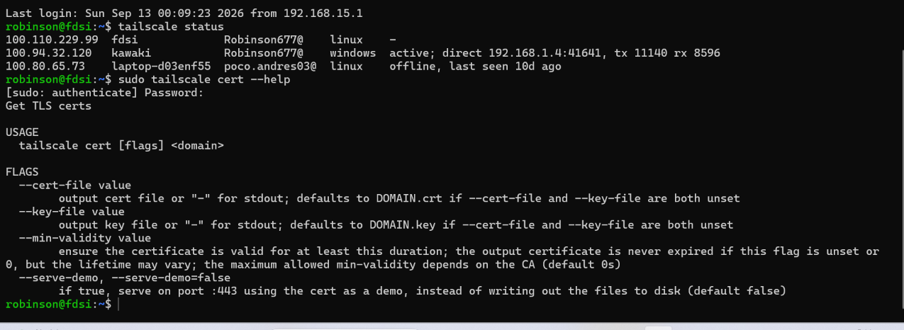

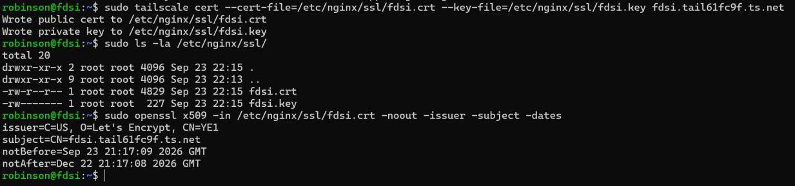

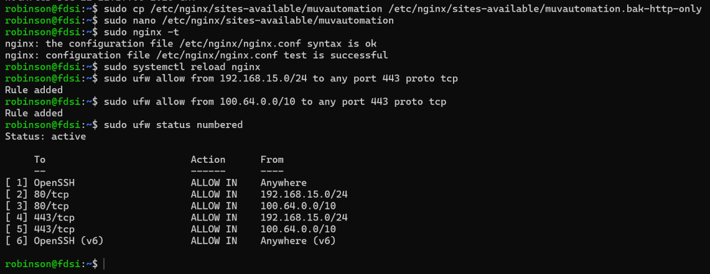

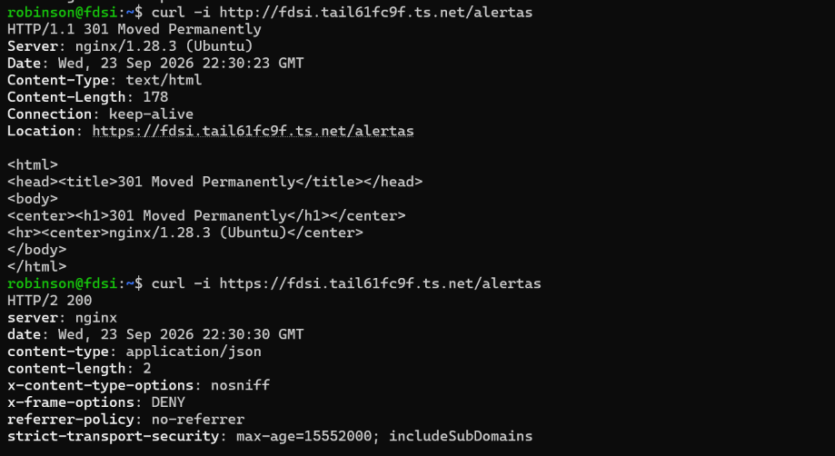

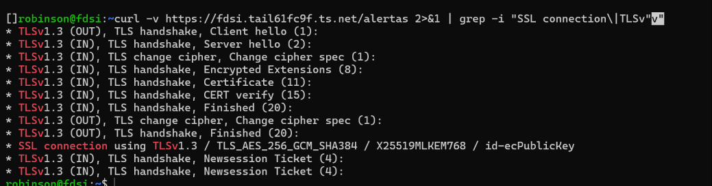

### Backend persistente (systemd)

El backend FastAPI dependía de un proceso manual (`uvicorn ... &`) que se perdía al cerrar la sesión SSH — el mismo problema que ya habían documentado como R9 en Lab 3. Se creó `falcon-api.service` con `Restart=on-failure`, quedando tan persistente como Nginx.

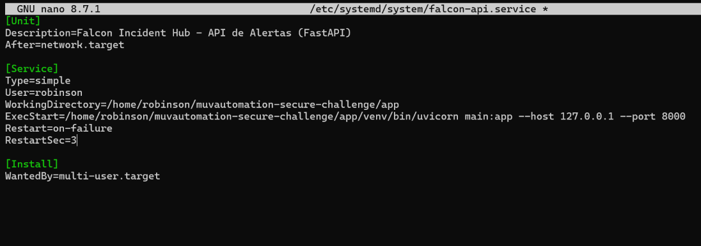

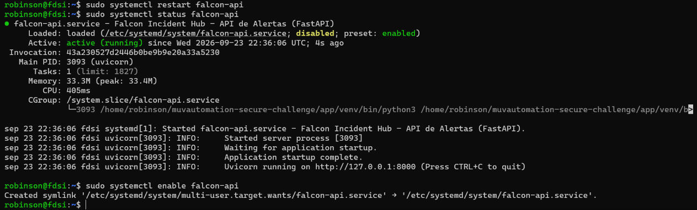

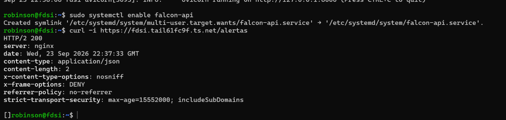

### Autenticación JWT y control de acceso por rol

`POST /token` emite un JWT firmado (30 min de validez) tras validar usuario/contraseña. Dos roles: `viewer` (solo lectura) y `analyst` (lectura + escritura). Cada acción de escritura queda registrada en un log de auditoría en memoria con el usuario real, no solo la IP de origen — esto cierra el gap de Repudiation (R7) que quedó pendiente en Lab 3.

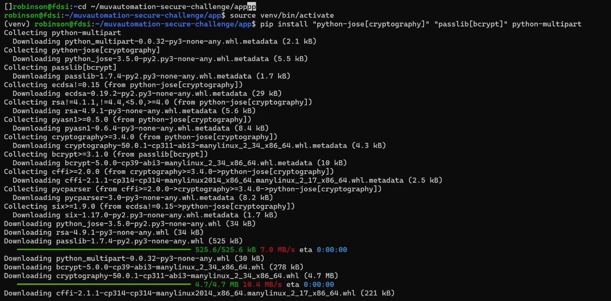

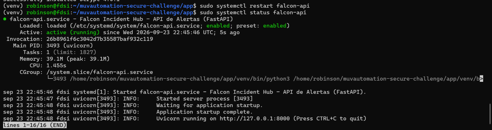

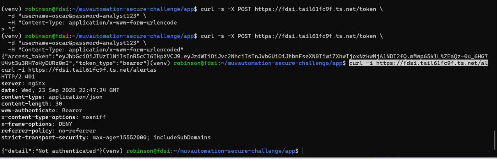

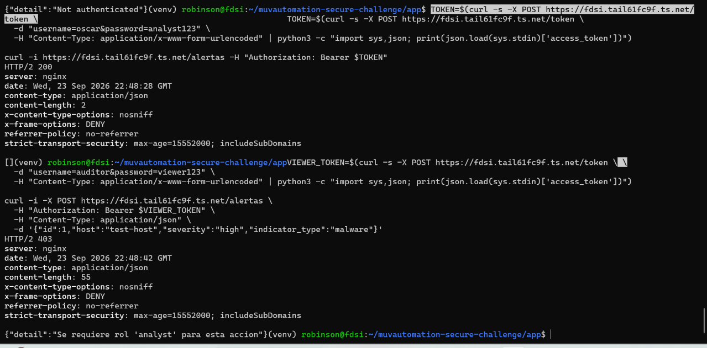

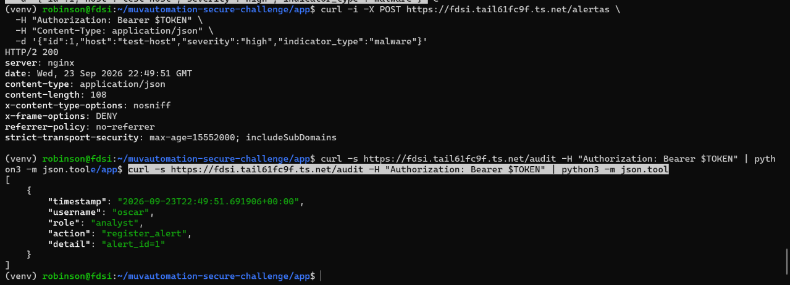

**Resultado de las pruebas (ver `evidence/parte2/` para el detalle completo, un archivo por prueba):**

| Prueba | Resultado |
|---|---|
| Sin token | `401 Unauthorized` |
| Token válido (analyst), leer | `200 OK` |
| Token viewer, intentar escribir | `403 Forbidden` |
| Token analyst, escribir | `200 OK` |
| `GET /audit` con analyst | `200 OK`, log con usuario real |

### Riesgos resueltos

| Riesgo (Lab 3) | Estado en Lab 3 - Parte 2 |
|---|---|
| R3 — escritura no autenticada | ✅ Requiere JWT con rol `analyst` |
| R5 — confidencialidad del tráfico | ✅ TLS 1.3 con certificado real |
| R6 — integridad del tráfico | ✅ TLS 1.3 con certificado real |
| R7 — repudiation (sin identidad) | ✅ Audit log con usuario real |
| R10 — sin control de acceso/roles | ✅ Roles `viewer`/`analyst` |

---

## ❓ Preguntas de análisis

### Purple Team (Fase D, Lab 3)

**¿Qué pudo observar el Red Team sin explotar ninguna vulnerabilidad?**
La versión exacta de Nginx (`nginx 1.28.3 (Ubuntu)`, vía `nmap -sV` y headers `curl`), el esquema completo de la API (4 endpoints, parámetros y modelos de datos) a través de `/docs` y `/openapi.json`, y el comportamiento de rutas inexistentes (`404` limpio, sin filtrar información). Todo esto con reconocimiento pasivo — `nmap`, `curl`, ZAP en modo pasivo — sin enviar un solo payload malicioso.

**¿Qué pruebas de red no aparecieron en `access.log` y por qué?**
El escaneo inicial `nmap -Pn -sS -v -p 80` (SYN scan / "half-open") no dejó rastro en `access.log`. Un SYN scan solo completa el primer paso del handshake TCP (SYN → SYN-ACK) y nunca llega a enviar una solicitud HTTP real; `access.log` de Nginx solo registra peticiones HTTP completas a nivel de aplicación, así que un sondeo que se queda en la capa de transporte es invisible para ese log. Solo el `nmap -sT -sV` posterior (que sí completa la conexión TCP) generó tráfico HTTP visible.

**¿Qué control aplicado reduce exposición, pero no resuelve el riesgo de HTTP?**
La restricción por IP (`allow`/`deny`) sobre `/docs` y `/openapi.json` en Fase E. Oculta el endpoint de quien no está en la lista blanca, pero no resuelve el problema de fondo: sin TLS, cualquier tráfico permitido seguía viajando en texto claro, y sin autenticación real, cualquiera *dentro* del rango permitido seguía teniendo acceso total. Es mitigación de exposición, no eliminación de la causa raíz — la misma distinción que quedó marcada como 🟡 Mitigado (no ✅ Corregido) en `risk-register.md`.

**¿Qué datos necesitaría Blue Team para distinguir un `curl` legítimo de una actividad sospechosa?**
Con solo IP y User-Agent (lo que tenía `access.log` en Lab 3) no alcanza — ambos son falsificables y compartidos entre varios usuarios de una misma red. Se necesitaría identidad real del solicitante (usuario autenticado, no solo origen de red), una línea base de comportamiento normal para comparar contra desviaciones, y contexto de secuencia (¿este patrón de rutas y tiempos corresponde a un flujo humano normal o a un barrido automatizado?). Es exactamente el gap que resolvió el `audit_log` con JWT en la Parte 2: ahora una escritura queda asociada a `username`, no solo a una IP.

**¿Qué amenaza STRIDE debe priorizarse en la segunda parte del laboratorio?**
Según la tabla de severidad del `risk-register.md`, **R3 y R10 (Elevation of Privilege)** tenían la calificación más alta (Alta/Alto/Alta) — cualquiera en la red podía escribir o alterar alertas sin ninguna verificación, y no había diferencia de privilegios entre un lector y un administrador de facto. Por eso la autenticación con roles fue la prioridad de fondo, aunque en la práctica hubo que resolver primero R5/R6 (TLS) porque de nada serviría un login si las credenciales viajaban en texto claro.

**¿Qué conclusión propuesta por la IA no pudo comprobarse directamente?**
Durante el retest de `nmap` en la Parte 2, la primera hipótesis planteada fue que el resultado `filtered` (`no-response`) se debía a que el tráfico estaba pasando por un relay DERP de Tailscale en vez de una conexión directa. Al correr `tailscale ping`, el resultado mostró conexión **directa** (`via 152.201.68.113`, 28ms), no un relay — así que esa hipótesis específica quedó descartada por la propia evidencia, no confirmada. La causa exacta del timeout puntual de `nmap` (pérdida de un paquete, timing por defecto muy ajustado) nunca se aisló con certeza; solo se confirmó que reintentar con `-T2 --max-retries 5` resolvía el síntoma.

### Preguntas del docente (Lab 3 - Parte 2)

**Si tengo HTTP, ¿cómo migro correctamente a HTTPS?**
Se necesita un certificado válido para el hostname del servidor. En este caso, `tailscale cert` emitió uno real de Let's Encrypt sin necesitar dominio público, aprovechando que el equipo ya opera sobre una red Tailscale. Luego Nginx se configuró con dos bloques `server`: uno en el puerto 80 que solo hace `return 301 https://$host$request_uri;`, y otro en el 443 que sirve el contenido real con TLS. Ver sección "TLS / HTTPS" arriba.

**Si utilizo TLS, ¿qué versión debería configurar?**
Solo **TLS 1.2 y 1.3** (`ssl_protocols TLSv1.2 TLSv1.3;`), nunca 1.0 ni 1.1 — tienen vulnerabilidades conocidas (BEAST, POODLE) y están deprecadas por los estándares actuales (NIST, OWASP). Verificado con `curl -v`: la negociación cae directo en TLS 1.3 con cifrado AEAD (`TLS_AES_256_GCM_SHA384`).

**¿Estoy exponiendo servicios o puertos que realmente no necesito?**
El backend FastAPI nunca se expone directamente — escucha solo en `127.0.0.1:8000` (loopback), y todo pasa por el reverse proxy de Nginx. Los puertos 80 y 443 están además restringidos por `ufw` al segmento del laboratorio y al rango Tailscale del equipo, no abiertos a "Anywhere". Queda como pendiente de revisión: el puerto 22 (SSH) sigue permitido desde "Anywhere" — sería el siguiente candidato a restringir.

**¿Qué componentes deberían estar restringidos?**
`/docs` y `/openapi.json` (por IP, desde Fase E), y ahora toda operación de escritura (`POST`/`PATCH /alertas`), restringida por rol JWT (`analyst`). El endpoint nuevo `GET /audit` también quedó restringido solo a `analyst`, para que no cualquiera pueda ver el historial de acciones de otros usuarios.

**¿Qué controles puedo agregar para reducir la superficie de ataque?**
`server_tokens off` (oculta versión de Nginx), headers de seguridad (`X-Content-Type-Options`, `X-Frame-Options`, `Referrer-Policy`, y ahora `Strict-Transport-Security`), autenticación obligatoria en todos los endpoints de `/alertas`, control de acceso por rol, y un backend persistente vía `systemd` que reduce la ventana de indisponibilidad frente a caídas.

**¿Cómo cambia mi arquitectura después del análisis de amenazas?**
Pasó de 2 límites de confianza (tránsito de red, proxy→aplicación) a 4: se agregaron autenticación (¿JWT válido?) y autorización por rol (¿rol == analyst?) como nuevas fronteras explícitas antes de llegar al backend. Ver el diagrama DFD actualizado arriba, en la sección "Arquitectura fortalecida (Lab 3 - Parte 2)".

---

## 🤖 Uso responsable de IA

La IA se emplea como **copiloto analítico**, nunca como autoridad. Todo hallazgo se valida contra comandos, logs, PCAP o configuración real. No se comparten IP reales, PCAP completos ni datos sensibles; toda evidencia se anonimiza antes de su uso.

---

## ✍️ Reflexiones individuales

### Robinson Steven Núñez Portela

Este laboratorio empezó para mí con algo muy simple: levantar el servidor Ubuntu, instalar Nginx y verificar que escuchara en el puerto 80. Parece un paso técnico sin mucha ciencia, pero fue la base de todo lo que vino después. Configurar el virtual host como reverse proxy hacia el backend en FastAPI y limitar el firewall solo al segmento del laboratorio me hizo entender que cada línea de configuración es una decisión de seguridad, aunque en el momento no lo parezca.

Lo que más disfruté fue revisar access.log y error.log línea por línea buscando el rastro de mi compañero. Ver ocho respuestas 404 casi seguidas, con el User Agent delatando el escaneo de nmap, fue como armar un rompecabezas con piezas que ya estaban ahí. También aprendí que las reglas de detección simples, como contar cinco 404 en cinco minutos, tienen huecos. Un usuario legítimo con enlaces rotos las dispara igual, y un atacante paciente las esquiva sin esfuerzo.

Aplicar el hardening en el propio servidor fue la parte que más me hizo pensar. Ocultar la versión de Nginx y restringir el acceso a docs por IP se sintió como un avance real, pero también entendí sus límites apenas probé el bloqueo y me di cuenta de que ni mi propia máquina entraba en el rango permitido, porque todos trabajamos por Tailscale. Tuve que ajustar la configuración pensando en cómo trabajamos de verdad, no en cómo asumía. La API sigue sin autenticación real, y eso queda para el siguiente laboratorio.

### Oscar Andrés Sánchez Porras

Atacar la aplicación desde Kali me enseñó que el reconocimiento no necesita exploits sofisticados para revelar información valiosa. Bastó un nmap con detección de versión para confirmar exactamente qué Nginx corría el servidor, y un simple curl a docs para encontrar el esquema completo de una API que nadie pensó en ocultar. Swagger UI, pensado para facilitar el desarrollo, terminó siendo el hallazgo más significativo del ejercicio, ya que expuso los cuatro endpoints, sus parámetros y modelos de datos sin que tuviera que adivinar nada.

Lo que más me hizo reflexionar fue ver mi propio rastro reflejado después en el access.log de mi compañero. Cada comando que corrí, el escaneo, las rutas de fingerprinting, la exploración manual con ZAP, quedó con timestamp, IP y User Agent, y coincidía al segundo con lo que él encontró del otro lado. Entendí que un atacante real no necesita ser sigiloso para ser efectivo, pero también que ser detectado no es lo mismo que ser identificado. Mi IP quedó registrada, no mi identidad.

Verificar el hardening después fue igual de revelador. Intentar acceder a docs y recibir un 403 Forbidden en vez del Swagger de siempre confirmó que una restricción simple por IP cierra una puerta real, aunque no resuelve el problema de fondo. La API sigue sin autenticación, y cualquiera dentro del segmento autorizado puede escribir o modificar alertas sin dejar más rastro que una dirección compartida.

---

## ✅ Checklist de cierre

- [?] IP objetivo autorizada por el docente
- [x] Sin datos reales en el contenido (alertas simuladas)
- [x] Servicio HTTP accesible desde el segmento permitido
- [x] Comandos y timestamps conservados (Red Team)
- [x] Mínimo 3 eventos correlacionados (Blue Team). 8 eventos, ver `evidence/blue/correlacion-purple-team.md`
- [x] PCAP limitado al tráfico del laboratorio
- [x] Headers de seguridad y reducción de exposición aplicados (Fase E)
- [x] Retest ejecutado (Fase F). Headers, IP y nmap verificados
- [x] Riesgos pendientes documentados para el Laboratorio 3 - Parte 2
- [x] Tag `lab-3` publicado
- [x] Reflexión individual (máx. 250 palabras)

<div align="center">

**Secure Product Challenge · FDSI**
*Laboratorio 3 — Red Team + Blue Team · Uso académico autorizado*

</div>
